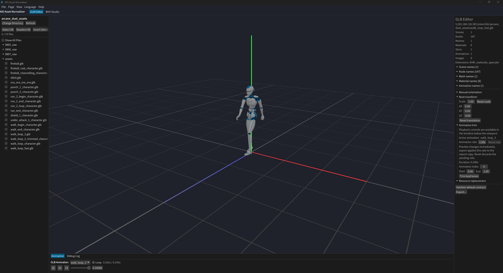
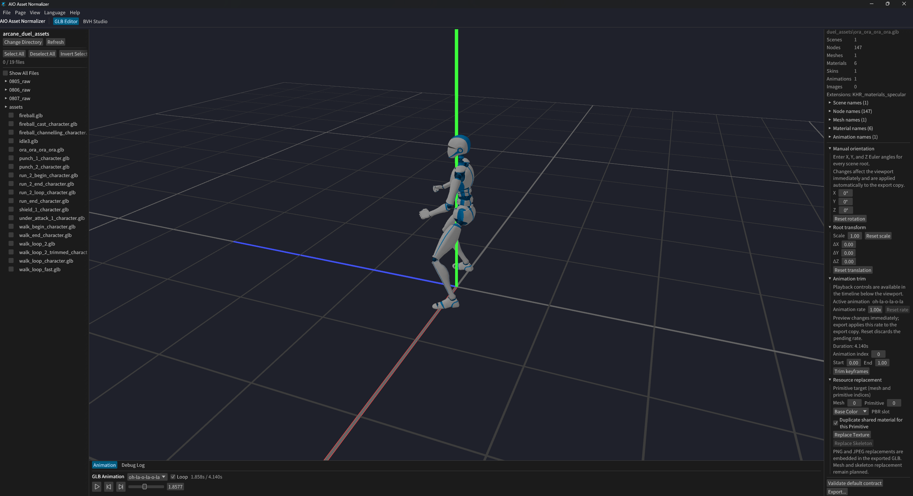

# AIO Asset Normalizer

_A pure-Rust GLB editor and BVH motion retargeting tool — portfolio showcase_

Welcome to my portfolio page for **AIO Asset Normalizer**, a desktop application
that helps indie game developers and independent creators standardize `.glb` 3D
assets. The tool is written entirely in Rust, runs without Blender or any
external conversion pipeline, and is built around a clear, user-confirmed
standardization contract.

## Project Overview

AIO Asset Normalizer began as a Blender-dependent multi-format converter and has
been completely redesigned into a focused desktop tool for `.glb` assets. The
current product provides:

- GLB editing, preview, and standardized export
- Animation clip playback, timeline controls, trimming, and export
- Mesh material and PBR texture replacement
- BVH playback, trimming, generic skeleton mapping, and GLB animation export
- Reusable Mapping files for different motion-capture systems and character
  models
- CLI mode for scripting batch operations on large volumes of similar assets

What makes the project stand out is the engineering approach: the entire GLB
loading, editing, animation processing, and export pipeline is implemented in
Rust, while the existing `egui` + `three-d` foundation provides the window, 3D
canvas, orbit camera, axes, grid, and skeleton visualization.

## Screenshots





## Design Goals

The project follows a few core principles:

- **GLB only.** glTF 2.0 Binary (`.glb`) is the single supported format; FBX,
  OBJ, Blend, and other source formats are out of scope.
- **No external dependencies at runtime.** No Blender, no Blender API, and no
  external conversion process.
- **Pure-Rust pipeline.** GLB loading, editing, animation processing, and export
  are all implemented in Rust.
- **Decoupled architecture.** UI, GLB document processing, BVH algorithms, and
  rendering stay separate; expensive work runs in background tasks and
  communicates through message passing.
- **Safe exports.** Source files are never overwritten by default; exports use
  temporary files and atomic replacement.
- **Honest error handling.** Unsupported features such as Draco, Meshopt,
  CUBICSPLINE, or Morph Target clips are reported explicitly instead of silently
  producing corrupted files.

## GLB Editor

The main page edits existing GLB files instead of converting between formats.

- Load, inspect, and preview scenes, nodes, meshes, materials, skins, skeletons,
  and animations
- Play standard GLB node and skinned-mesh animations with pause, looping, speed,
  seeking, and frame stepping
- Support `STEP` and `LINEAR` animation sampling; report unsupported
  `CUBICSPLINE` and Morph Target clips explicitly
- Adjust model orientation with XYZ `±90°` shortcuts and precise Euler input
- Trim animation clips by start and end time and rebuild the timeline
- Replace Base Color, Normal, Metallic-Roughness, Occlusion, and Emissive
  textures
- Reserve extension points for future skeleton and mesh replacement
- Export game-ready GLBs with consistent coordinates, units, grounding, and
  facing

## BVH Studio

BVH processing lives on an independent page. It takes a BVH file, a target GLB,
and a Mapping file, then lets you:

- Play and inspect BVH motion frame by frame
- Trim and save BVH files
- Retarget BVH motion to any target skinned GLB that satisfies the input
  contract
- Export a Character Package containing a character and animation
- Export an Animation Clip containing only the skeleton and animation
- Use explicit Mapping files to support different motion-capture systems and
  character naming conventions

The Mapping file is the single source of truth for retargeting. Automatic name
matching only produces suggestions; the user must confirm them before export.
The initial format is versioned JSON:

```json
{
  "schema_version": 1,
  "source": {
    "up_axis": "Y",
    "forward_axis": "-Z",
    "unit": "cm",
    "root": "Hips"
  },
  "target": {
    "skin": "Armature",
    "root": "pelvis"
  },
  "bones": [
    {
      "source_joint": "Hips",
      "target_node": "pelvis",
      "rotation_offset_xyzw": [0.0, 0.0, 0.0, 1.0]
    }
  ]
}
```

The target-model contract requires a conventional glTF Skin with valid
`JOINTS_0`, `WEIGHTS_0`, and inverse bind matrices. Fixed company models, fixed
skeleton sizes, fixed N-Pose assumptions, serial protocols, and IMU logic are
intentionally kept out of this generic tool.

## Standardization Contract

The default export contract produces consistent, game-ready assets:

- Right-handed coordinates
- Y-Up
- Model forward direction `-Z`
- Meter-based output by default
- Bounding box centered on the XZ plane
- Lowest point placed at `Y = 0`
- Identity scene-root transform
- Orientation, scale, skin, inverse bind matrices, and root animation baked
  together

Grounding, centering, and unit scaling can be disabled or adjusted in the export
options.

## Technology Stack

| Layer                      | Technology                                                |
| -------------------------- | --------------------------------------------------------- |
| GUI                        | `egui` through `three-d`                                  |
| 3D viewport                | `three-d` / `wgpu`                                        |
| GLB loading and validation | `gltf`                                                    |
| GLB document editing       | Preserve raw JSON + BIN; use `gltf-json` when appropriate |
| Image processing           | Rust `image` ecosystem                                    |
| Background tasks           | `std::sync::mpsc` + worker threads                        |
| File dialogs               | `rfd`                                                     |

The GLB read/write layer preserves the original JSON and BIN data and changes
only affected resources wherever possible. This helps retain unknown extensions,
`extras`, and the original resource layout.

## Engineering Highlights

- **Owning the pipeline in Rust.** With no Blender bridge, GLB parsing, document
  editing, animation baking, and export are all implemented and tested in one
  language.
- **Safe atomic writes.** Every export goes through a temporary file and is
  reparse-validated before replacing the destination, so source files stay
  intact.
- **Decoupled background processing.** Heavy document and BVH work runs on
  worker threads and communicates with the UI through message passing, keeping
  the interface responsive.
- **A reusable retargeting contract.** Versioned Mapping files decouple
  motion-capture source conventions from target character naming, making the
  tool work across different capture systems and models.
- **Explicit extension handling.** Features that cannot be safely processed are
  reported instead of corrupted silently.
- **CLI mode for batch scripting.** The project provides a CLI mode that enables
  writing scripts for batch processing of large volumes of similar assets,
  supporting automation of repetitive workflows.

The project is licensed under the MIT License.
