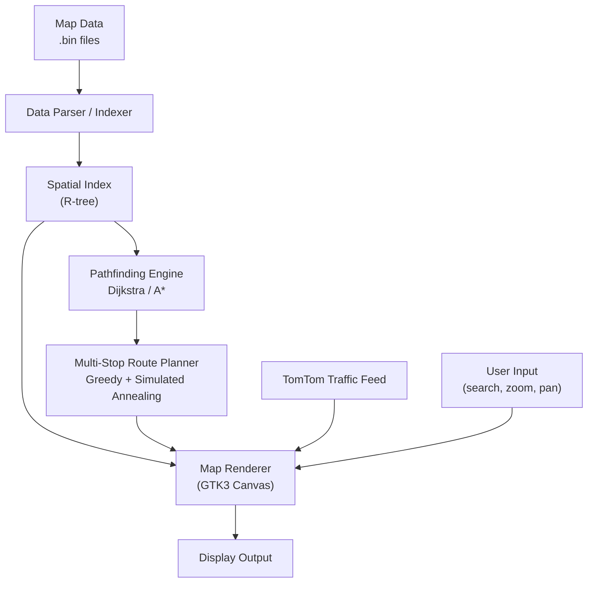

## Overview

Delivery Duo is a geographic information system built as a second-year course
project. It is designed to help delivery drivers explore a map, search for
intersections, and plan routes with multiple stops.

The application was developed over the course of a semester by a small team of
students, with a focus on delivering a polished, responsive desktop experience
even when handling large-scale geographic datasets.

## Technical approach

- **Language & toolkit:** C++17 with GTK3 for the graphical interface, built and tested on Debian 11 with the MATE desktop environment
- **Data pipeline:** Raw geographic data (`.bin` format) is parsed and indexed into spatial data structures that power the dynamic, interactive map canvas
- **Live traffic:** Real-time traffic data is fetched from the TomTom Traffic API via **libcurl** and rendered as colour-coded congestion overlays on the map where available
- **Concurrency:** A multithreaded design keeps map rendering and route calculations responsive, ensuring the UI never blocks during heavy computation
- **Shared libraries:** Dynamically links against GTK3, libcurl, and several other shared libraries at runtime rather than static linking

### Routing algorithms

The pathfinding engine combines **Dijkstra's algorithm** for exact shortest-path
calculations with **A\*** for faster heuristic-guided search when a destination
is known.

For multi-stop delivery planning, the system uses a **multi-start greedy**
construction heuristic followed by **simulated annealing** to refine the
solution and escape local optima, producing near-optimal routes across dozens
of stops in seconds.

## Architecture

> **Note:** This section will be expanded with a detailed breakdown of the
> system's internal modules, data structures, and inter-process communication
> patterns. Please refer to the Mermaid diagram below for a high-level overview.

The diagram above shows the primary data flow: raw map files are parsed into a
spatial index, which feeds both the rendering pipeline and the routing engine.
Traffic overlays are merged at render time, and all user interactions are handled
through the GTK3 event loop.

## User experience

Users can import map data from `.bin` files, search for an intersection by two
street names, and freely pan and zoom the map. The interface is designed to feel
snappy — map tiles render in real time as the user navigates, and intersection
search results are highlighted with a pulsing marker so they are easy to spot.

Traffic jams are shown directly on the map as colour-coded road segments, while
low zoom levels automatically declutter the view by hiding minor roads and
points of interest.

### Key interactions

- **Import** — Load a `.bin` map file to populate the map canvas
- **Search** — Enter two street names to locate an intersection
- **Navigate** — Pan by dragging and zoom with the scroll wheel or toolbar buttons
- **Route planning** — Select multiple stops and compute an optimised delivery route
- **Traffic toggle** — Show or hide the real-time traffic overlay

## Presentation

The project presentation is available through the link above.

