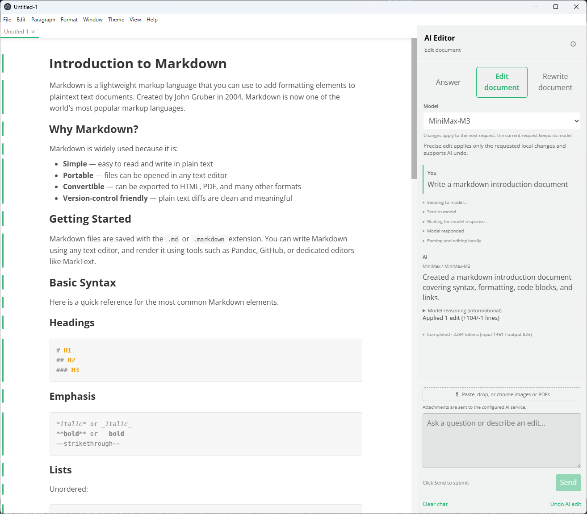
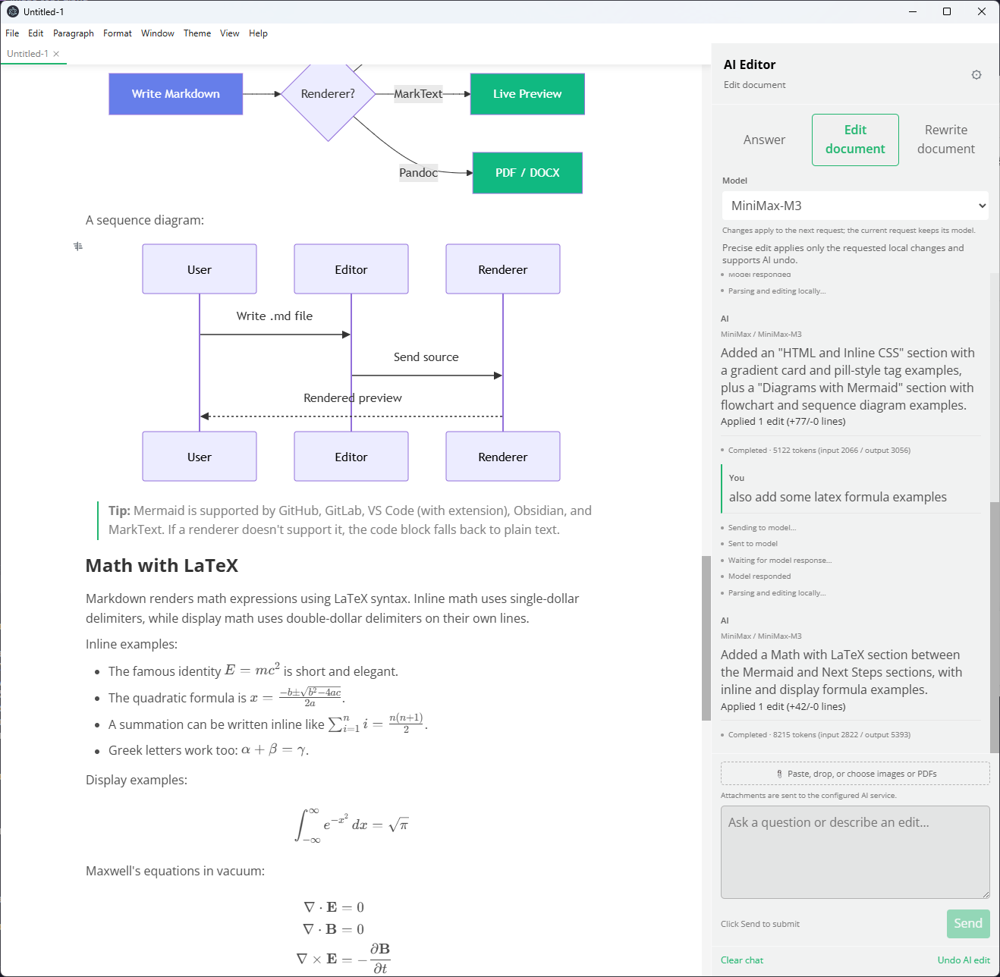
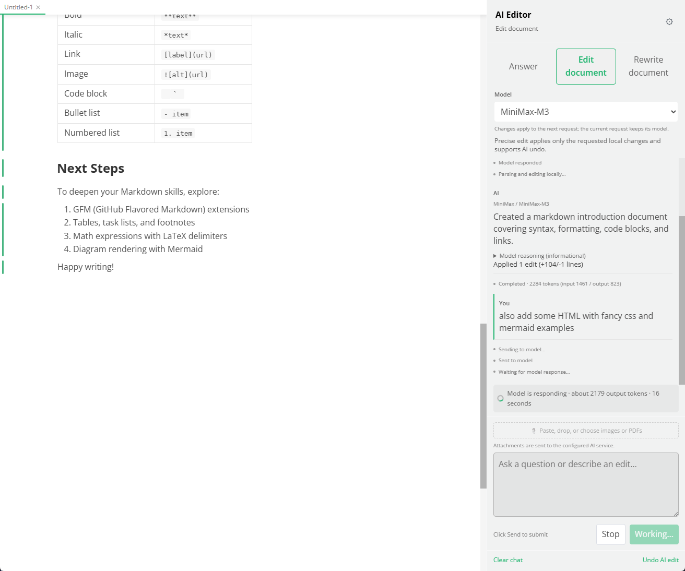
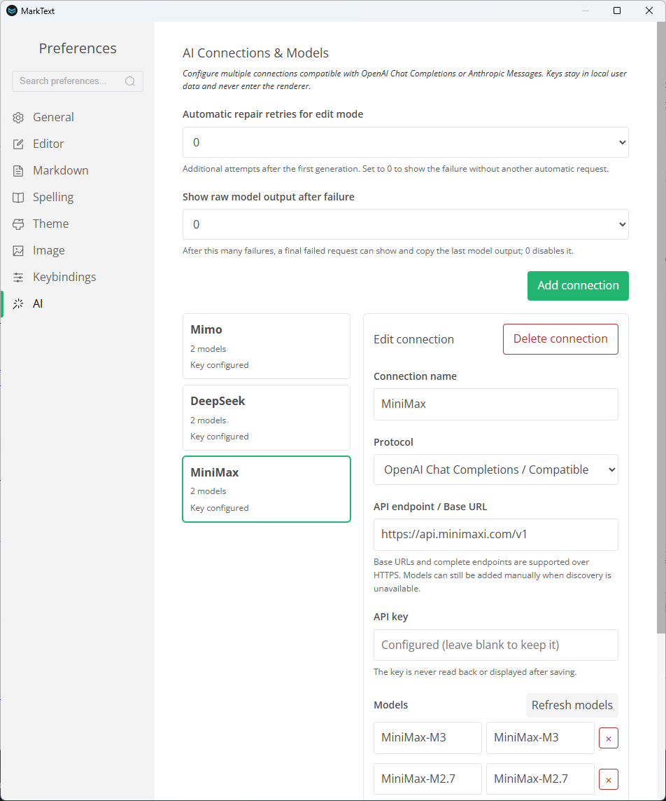
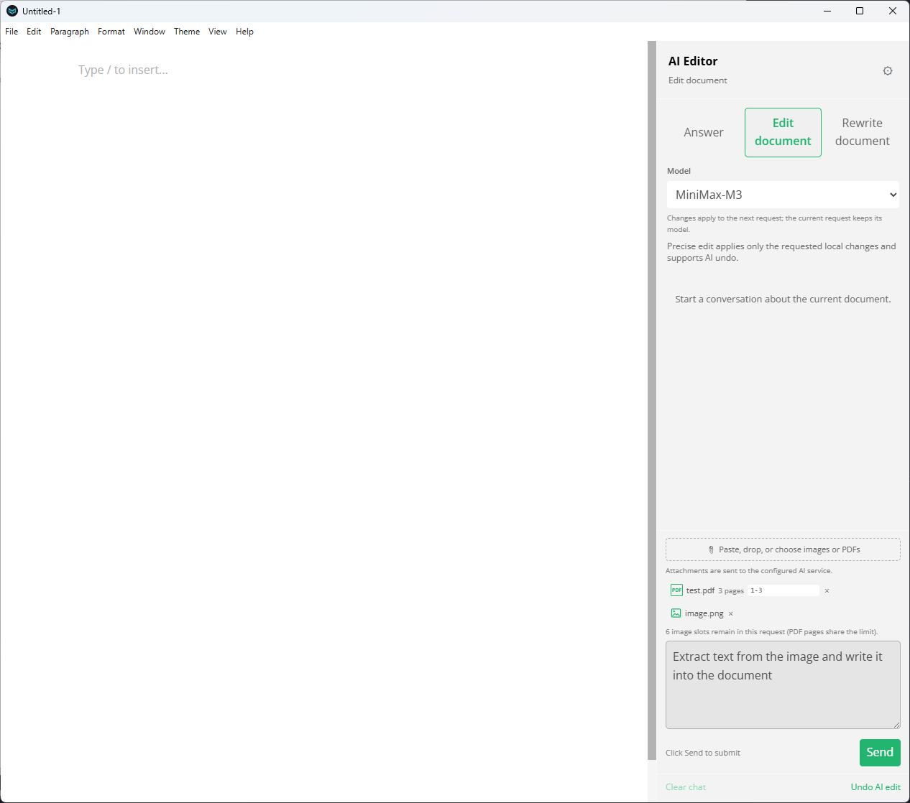
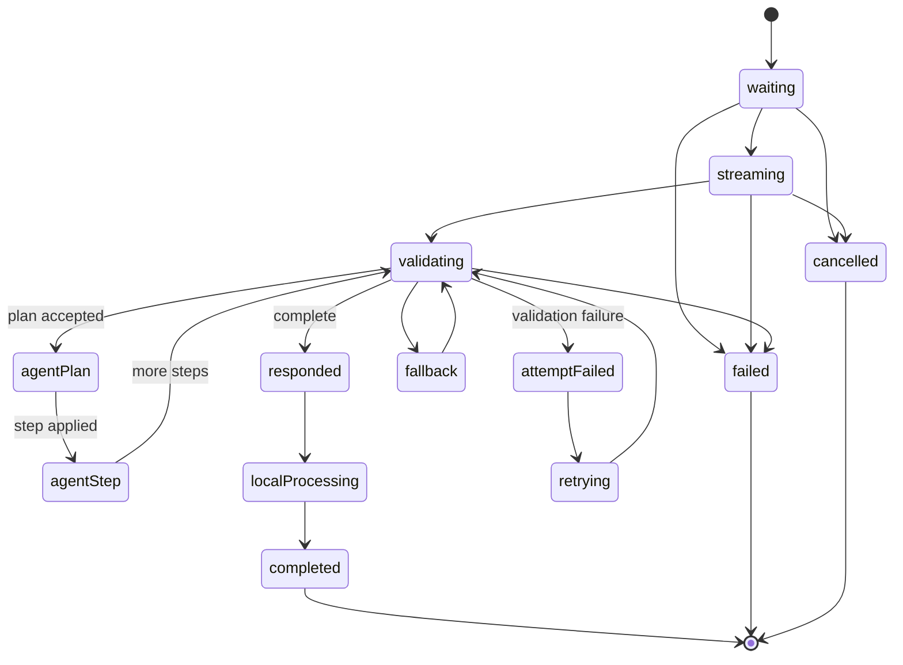
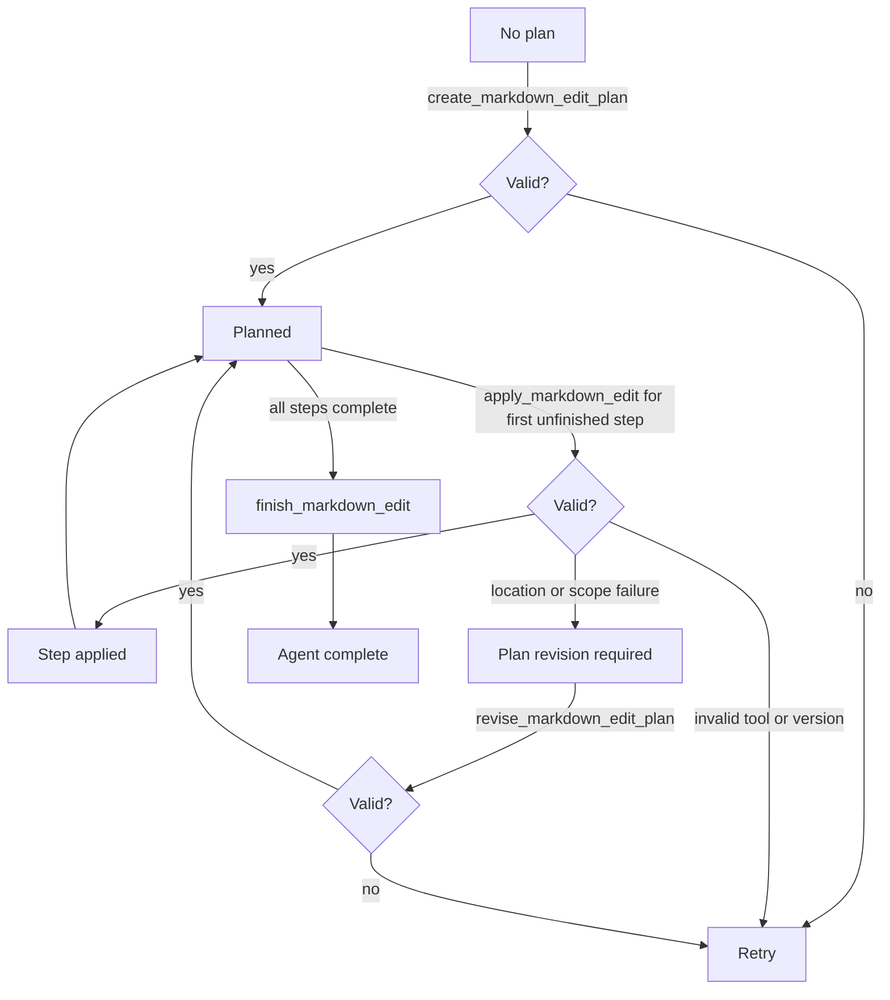

A desktop Markdown editor based on a fork of MarkText that brings Agent collaboration directly into the writing workflow. It preserves MarkText's lightweight, focused editing experience and adds Agent conversation, local modifications, full-document rewriting, and multimodal input capabilities for real document work.

## Screenshots

## Project Overview

- **Project type**: Desktop Markdown editor / Agent writing tool (forked from MarkText)
- **Core scenarios**: Technical documentation, product proposals, meeting notes, research notes, and everyday writing
- **Supported platforms**: macOS, Windows, Linux
- **Product positioning**: Make the Agent a collaborator in the document workflow, rather than a chat window separated from the editor

## Why Build This Project

Traditional AI writing tools can usually only generate a new paragraph of content, and the user still has to manually copy, locate, and merge the result. For Markdown documents, this process can easily break formatting, alter code blocks by mistake, or overwrite recent manual edits.

MarkText + Agent takes "the current document" as context, placing Agent capabilities in the editor's sidebar. Users can ask questions and request changes around the content they are editing, then safely apply the results back to the original text after confirming them.

On a personal level, I have been actively learning how Agents work—how they reason, plan, and act—and I regularly encourage the people around me to embrace Agent-powered tools in their daily lives. This project doubles as an accessible entry point for that purpose: because it embeds Agent capabilities inside a familiar Markdown editor, family and friends who are new to AI can experience the power and efficiency of Agents without leaving the writing workflow they already know.

This project is forked from [MarkText](https://marktext.app/) and inherits its WYSIWYG preview, source-code mode, focus mode, typewriter mode, multi-tab editing, theme switching, image pasting, and fundamental capabilities such as CommonMark / GFM, math formulas, Mermaid, PlantUML, tables, task lists, and HTML / PDF export. The focus of the fork is on deeply integrating the Agent experience rather than reimplementing these features.

## Core Features

### 1. Three Agent Working Modes

- **Answer**: Ask questions about the current document, summarize content, or request writing advice—returns suggestions only and does not modify the original text.
- **Edit Document**: Precisely modify local content based on natural language instructions, such as improving a passage, adding a section, fixing a heading, or restructuring a list.
- **Rewrite Document**: Rewrite the entire Markdown under a clear user intent, and display the result before applying it.

These three modes keep "consultation," "local collaboration," and "overall restructuring" separate from one another, reducing the risk of unintended operations and ensuring that users always know what the Agent will do to the document.

### 2. Document-Oriented Continuous Conversation

The Agent panel maintains conversation history around the current document. Users can follow up with additional questions, add constraints, or adjust tone without repeatedly copying the entire document into an external chat tool.

### 3. Image and PDF Input

Supports pasting, dragging in, or selecting PNG, JPEG, WebP, and GIF images, as well as importing PDFs. PDF pages are rendered locally as images before being sent to vision-capable models, and users can choose which pages to analyze—ideal for screenshots, design drafts, flowcharts, scanned materials, and proposal attachments.

### 4. Multiple Connections and Model Switching

The Agent settings support configuring multiple service connections and models, and can switch between OpenAI Chat Completions-compatible endpoints and Anthropic Messages endpoints, as well as custom HTTPS endpoints. Connections support testing, refreshing the model list, manually adding models, and setting a default model—making it easy to switch quickly between different models or services.

### 5. Visualized Modification Results and Agent Undo

After a local edit is completed, the editor marks the changed content and displays the number of added or removed lines along with the modification locations. Users can click the markers to navigate to the changes, or directly undo the most recent Agent edit to restore the Markdown state from before the Agent operation.

### 6. Real-Time Token Usage Monitoring

The Agent panel surfaces token consumption as a live, observable signal rather than a hidden backend metric. While a request is streaming, a real-time output token counter advances with each token the model generates, giving users an immediate sense of verbosity. When the response completes, the panel reports the final usage breakdown and persists it alongside the chat history so it survives reload.

- **Real-time estimated output token count**: While streaming, the Agent panel displays a live-updating estimate of the output tokens generated so far. The counter advances with each token, giving users a direct sense of the model's verbosity—helpful for comparing whether a smaller, faster model or a larger, more thorough model fits the task.
- **Actual consumed token count after the conversation ends**: When the provider response is finalized, the panel reports the API's final usage breakdown (input tokens, output tokens, and total tokens) for that turn. Per-turn usage accumulates into a per-conversation total, displayed so users can see the cumulative cost of working on the current document.
- **Model-aware display**: Each response entry shows the model identifier alongside the corresponding token counts. When switching models mid-conversation, the panel clearly separates usage by model, making it easy to compare which model is more efficient for a given task and to understand each model's behavioral profile—whether it prefers concise answers, detailed explanations, or step-by-step reasoning.
- **Pre-send context estimation**: Before sending a message, the panel estimates input tokens based on conversation history and any attached files, helping users anticipate cost and avoid exceeding the model's context window.
- **Per-mode breakdown**: Because Answer, Edit Document, and Rewrite Document modes place very different loads on the model, token usage is broken down by mode so users can see, for example, that a Rewrite Document turn consumed far more output tokens than an Answer turn, reinforcing an intuitive understanding of each mode's cost profile.

This feature turns token consumption from an invisible backend metric into an observable signal that helps users choose the right model for the right task and develop a clearer mental model of how different services respond.

## AI Edit Agent Workflow

When a user sends an Edit Document or Rewrite Document request, the Agent orchestrates a multi-step workflow between the renderer, the main process, and the model provider. Two progress representations drive the experience:

- **Transient live progress** (`AiProgressEvent`): Sent over IPC during streaming, driving the current request indicator and incremental step application in the editor.
- **Persisted status messages** (`AiProgressInfo`): Stored in chat history so request status and model information survive reload—never sent back to the model.

### Request lifecycle

Every request follows the same outer lifecycle:

Before an `edit` or `rewrite` request starts, the renderer flushes the active editor surface, captures the raw Markdown snapshot and document identity, locks document mutations and tab switching, and sends only usable conversation messages to the main process. Persisted status messages are deliberately excluded from model context.

### Main-process edit state machine

For Edit Document requests, the precise Agent (`runDocumentEditAgent()`) follows a plan-based state machine:

**Plan creation**: The model creates exactly one plan before applying edits. Each plan step has an ID, description, intent, anchor points, and dependencies. The plan is validated against the current document version—non-empty documents require a valid starting anchor for the first step, while empty documents use an empty-insertion path.

**Incremental step application**: Only the first unfinished plan step may be applied at a time. Each step must use the current document version, match exactly once in the current Markdown, and pass Markdown compatibility checks. After validation, the main process updates its working Markdown, marks the step complete, and emits `agent-step` with before/after snapshots. The renderer applies that snapshot immediately, which is why the document can visibly change before the final response arrives.

**Completion and limits**: The model calls `finish_markdown_edit` only when every plan step is complete and a concise summary is provided. The Agent enforces bounded successful steps, invalid turns, plan revisions, and total runtime as safety boundaries, not additional retries.

### Progressive vs. transactional edits

When at least one Agent step was applied successfully, the renderer follows the **progressive path**: it waits for the final main-process response, records the accumulated change range, appends the assistant summary, and unlocks the editor. Already-applied steps are never replayed, and the final response does not call the full-document revision apply path.

If no Agent step was applied, `applyEdit()` uses the **transactional path** with the revision journal: prepare a revision from the exact raw snapshot, re-check the session and active document, apply to one active editor surface, and commit only after the editor confirms. Complete-document fallback results enter an `awaiting-confirmation` state rather than being applied silently.

### Failure and cancellation

- `attempt-failed`, `retrying`, and `fallback` are non-terminal progress describing model or validation recovery inside the same request.
- `failed` is terminal—provider failure, invalid tool output, exhausted Agent limits, or stale application failure.
- `cancelled` is emitted when the user stops an active request or the main process observes cancellation.
- A chat persistence error does not turn a successful document edit into a failure.
- A stale document result is never applied; the editor unlocks only after the request settles.

## Reliability Design

Content generated by the Agent is not written into the document unconditionally:

- Agent edits are based on the original Markdown snapshot saved when the request was sent.
- The editor is temporarily locked during modification to prevent conflicts from manual input, switching tabs, or switching edit modes.
- If the user modifies the file externally while waiting, the Agent result is invalidated and will not overwrite the new content.
- Local edits prioritize exact text matching, replacing only the ranges explicitly indicated by the model.
- When the model cannot produce a reliable local edit, the system presents the full replacement result as content pending confirmation rather than silently overwriting the original.
- Markdown code blocks, inline code markers, math formulas, and Front Matter are protected, so automatic fixes cannot damage existing formatting.

These mechanisms make using the Agent feel more like "reviewable edit suggestions" than irreversible automatic rewriting.

## Technical Implementation

The project is built on Electron, Vue 3, TypeScript, and Pinia. Agent capabilities use a separation between the main-process service and the renderer-side panel: network requests, API keys, attachment storage, and document revision records are managed by the main process, and the editor interface communicates with it through typed IPC.

Local edits use a structured editing protocol combined with exact text matching, together with revision records to implement commit, discard, and undo. The editor supports both WYSIWYG and source-code modes; Agent edits are applied to the currently active editing surface, keeping both editing approaches consistent.

## Project Highlights

This is a productization effort around Agent applied to real writing scenarios: it goes beyond simply wiring a model into the editor to address the full experience—context management, multi-model configuration, multimodal attachments, edit conflicts, result review, failure recovery, and reversible operations.
