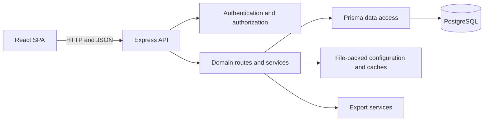

Tradeflow System is a lightweight trade and inventory management system for
small businesses. It brings purchasing, sales, inventory, partner settlements,
analysis, and operational governance into one workspace.

The project is designed to keep day-to-day transaction data connected to the
business views that depend on it, so inventory, balances, dashboards, and
reports remain part of the same operational model.

## Core Capabilities

### Operations and master data

- Record inbound purchases and outbound sales, including batch operations.
- Maintain products, product categories, business partners, and partner-specific
  price history.
- Track current stock together with the movement history behind it.
- Provide overview dashboards for sales, inventory changes, and low-stock
  products.

### Financial visibility

- Monitor customer receivables and supplier payables.
- Record payments and compare transaction totals with settled amounts.
- Group transaction records by invoice to support invoicing workflows and
  account review.

### Analysis and reporting

- Analyze purchasing and sales over selected time periods, partners, and
  products.
- Present summarized statistics alongside transaction-level details.
- Export operational, financial, inventory, and analytical data for further
  processing.

### Governance and collaboration

- Authenticate users and apply role-aware access control.
- Support reader, editor, and superuser responsibilities.
- Provide user administration and an audit log for traceability.
- Support a multilingual interface and configurable business presentation
  options.

## Design Ideas

### Transactions are the operational source of truth

Purchasing and sales records describe the business events that change stock and
financial positions. Higher-level views are derived from these records instead
of requiring users to maintain separate, disconnected summaries.

### Inventory is movement-based and repairable

Inbound movements increase stock and outbound movements decrease it. The
inventory ledger records these changes, while the current inventory view serves
fast operational reads. Because the ledger can be rebuilt from the underlying
transaction history, inventory remains recoverable when a derived view needs to
be repaired.

### Financial positions are derived from activity

Receivables and payables combine transaction totals with recorded payments. This
keeps customer and supplier balances tied to the same records used for
operations, while invoice and summary caches make repeated review more
efficient.

### Expensive views are computed deliberately

Overview statistics and analytical results are generated when needed and kept in
lightweight caches for subsequent reads. This separates transactional writes
from read-heavy dashboards without introducing another service boundary.

### Access control is part of the workflow

Authentication, role permissions, write protection, and audit visibility are
implemented across the frontend and API. The interface can adapt to a user's
role, while the backend remains the final enforcement point.

## High-Level Architecture



- **Frontend** — A React 19 and Vite single-page application organized around
  operational pages, reusable API hooks, role-aware navigation, charts, forms,
  and localization.
- **Backend** — A Node.js and TypeScript service built with Express. Route
  modules expose the application capabilities, while domain services handle
  inventory updates, aggregation, analysis, invoicing, and exports.
- **Persistence** — PostgreSQL stores transaction records, master data,
  inventory movements, payments, users, and audit events. Prisma provides the
  typed data-access layer.
- **Derived state** — Inventory totals, overview snapshots, invoice groupings,
  and analytical results are maintained as derived state close to the API so
  they can be refreshed independently of the core transaction history.
- **Configuration and presentation** — Business metadata, selectable options,
  localization, and export behavior can be adapted without changing the main
  application workflows.

## Technology Stack

| Layer       | Technologies                                                        |
| ----------- | ------------------------------------------------------------------- |
| Frontend    | React 19, Vite, Ant Design, Recharts, i18next                       |
| Backend     | Node.js, TypeScript, Express                                        |
| Data access | Prisma ORM, PostgreSQL                                              |
| Security    | JWT authentication, Argon2 password hashing, role-based permissions |
| Reporting   | Server-side aggregation, file-backed caches, spreadsheet export     |

## Project Structure

```text
frontend/      React application and user-facing workflows
backend/       Express API, domain services, and persistence integration
build-config/  Application metadata and configurable presentation behavior
docs/          Architecture, data-flow, and project reference documents
```

Tradeflow System is intended as a focused foundation for businesses that need
connected trade operations and inventory visibility without the weight of a
large enterprise platform.
