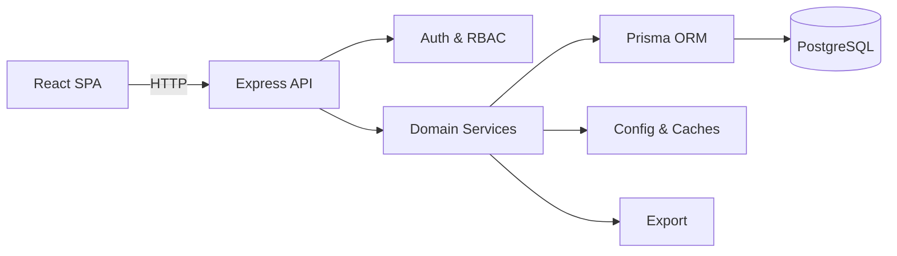

# Tradeflow System

> A lightweight, full-stack trade and inventory management platform for small
> businesses — built with React, Express, and PostgreSQL.

Tradeflow brings purchasing, sales, inventory tracking, partner settlements,
financial analysis, and role-based access control into one cohesive workspace.
Day-to-day transaction data stays connected to every business view that depends
on it, so dashboards, balances, and reports are always in sync.

---

## At a Glance

|                   |                                                                                       |
| ----------------- | ------------------------------------------------------------------------------------- |
| **Tech Stack**    | React 19 · Vite · Ant Design · Express · TypeScript · Prisma · PostgreSQL             |
| **Core Domain**   | Trade operations, inventory, finance, analytics                                       |
| **Architecture**  | Single-page app → REST API → Domain services → Relational store                       |
| **Key Qualities** | Movement-based inventory · derived financial positions · role-aware UI · multilingual |

---

## Feature Showcase

### 1. Operations & Master Data

Record purchases and sales (including batch operations), manage products,
categories, business partners, and partner-specific price history.

<!-- Screenshot: Main operations dashboard showing purchase/sale records and quick-action buttons -->


- Inbound & outbound transaction recording
- Product catalogue with categories
- Partner management with historical pricing

---

### 2. Inventory Management

Real-time stock levels backed by a full movement history. The movement ledger
can be rebuilt from transaction data, keeping inventory recoverable and
auditable.

<!-- Screenshot: Inventory view with stock levels table and movement history sidebar -->


- Current stock with movement-based tracking
- Low-stock alerts on overview dashboards
- Repairable ledger derived from transaction history

---

### 3. Financial Visibility

Monitor customer receivables and supplier payables, record payments, and
reconcile against transaction totals. Invoice grouping supports structured
billing workflows.

<!-- Screenshot: Finance panel showing receivables/payables summary and payment history -->


- Receivables & payables tracking
- Payment recording with settlement comparison
- Invoice grouping for account review

---

### 4. Analytics & Reporting

Analyze purchasing and sales across time periods, partners, and products.
Summarized statistics sit alongside transaction-level detail, and data can be
exported for external processing.

<!-- Screenshot: Analytics page with date-range selector, summary charts, and export button -->


- Period-based purchasing & sales analysis
- Chart-driven summaries with drill-down detail
- Spreadsheet export for all operational, financial, and analytical data

---

### 5. Access Control & Governance

JWT-based authentication with role-aware navigation. The interface adapts per
user role while the backend enforces permissions and records audit events.

<!-- Screenshot: User administration page showing role assignments and audit log -->


- Reader / Editor / Superuser roles
- User administration & audit log
- Multilingual interface with configurable presentation options

---

## Architecture Overview



| Layer             | Description                                                                                  |
| ----------------- | -------------------------------------------------------------------------------------------- |
| **Frontend**      | React 19 + Vite SPA — operational pages, reusable hooks, charts, forms, i18n                 |
| **Backend**       | Express + TypeScript — route modules, domain services, inventory & finance logic             |
| **Data**          | PostgreSQL via typed Prisma ORM — transactions, master data, movements, audit                |
| **Derived State** | Inventory totals, overview snapshots, invoice groupings, analytics — refreshed independently |

---

## Deployment & Production

Tradeflow ships with a complete Dockerfile for one-command deployment. The
container image bundles the frontend build and backend runtime, ready to run on
any Docker-compatible host — local machines, cloud VMs, or container
orchestration platforms.

> **Production case:** Tradeflow was customized and deployed on an AWS Lightsail
> instance for a small business, where it has been running continuously for over
> two years. Updates are delivered through Argo CD with zero-downtime rollouts,
> demonstrating the system's stability in a real operational environment.

- Full-stack Docker image — single container, no manual setup
- Persistent storage for database and file exports
- Compatible with CI/CD pipelines (Argo CD, GitHub Actions, etc.)

---

## Tech Stack

| Layer       | Technologies                                                    |
| ----------- | --------------------------------------------------------------- |
| Frontend    | React 19, Vite, Ant Design, Recharts, i18next                   |
| Backend     | Node.js, TypeScript, Express                                    |
| Data Access | Prisma ORM, PostgreSQL                                          |
| Security    | JWT, Argon2 hashing, role-based permissions                     |
| Reporting   | Server-side aggregation, file-backed caches, spreadsheet export |

---

## Project Layout

```text
frontend/      → React SPA — pages, hooks, components, i18n
backend/       → Express API — routes, services, Prisma schema
build-config/  → Metadata & presentation config
docs/          → Architecture & data-flow references
```

---

_Tradeflow is designed as a focused, production-ready foundation for businesses
that need connected trade operations without the overhead of a large enterprise
platform._
